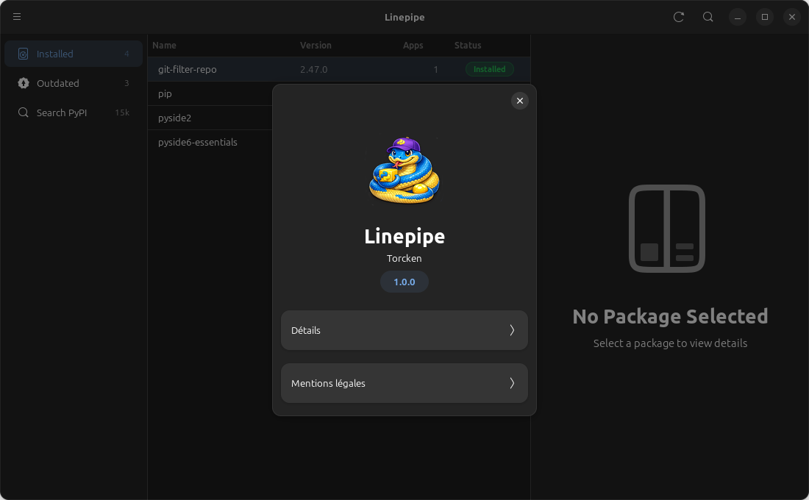

<p align="center">
  
</p>
<h1 align="center">Linepipe</h1>
<p align="center">
A Modern GNOME Interface for Pipx packages.
</p>

# 


**Linepipe** lets you install, upgrade, uninstall, inject, and run pipx-managed Python
applications through a native GNOME interface — no terminal required.



<a href="https://www.buymeacoffee.com/torcken" target="_blank">
  
</a> 

To **support** and **maintain** this project !

---

## Features

- **List installed packages** with version, Python version, exposed apps, and injected deps
- **Install** packages from PyPI with optional version pinning, `--include-deps`, and custom Python
- **Upgrade** individual packages or all at once (`pipx upgrade-all`)
- **Uninstall** with confirmation dialog
- **Inject / Uninject** extra dependencies into existing pipx venvs
- **Run** exposed application binaries with optional arguments
- **Outdated detection** — checks PyPI JSON API in the background, highlights outdated packages
- **Search PyPI** — filter installed list instantly; press Enter for exact PyPI lookup
- **Desktop notifications** on operation success/failure
- **GNOME HIG compliant** — Adwaita styling, toast notifications, dark/light mode

---

## Keyboard shortcuts

| Shortcut        | Action                  |
| --------------- | ----------------------- |
| `Ctrl+R` / `F5` | Refresh installed list  |
| `Ctrl+F`        | Focus search bar        |
| `Ctrl+P`        | Open Preferences        |
| `Ctrl+I`        | Open Install dialog     |
| `?`             | Show keyboard shortcuts |
| `Ctrl+Q`        | Quit                    |

---

## Requirements

- Linux with GTK 4.0+ and libadwaita 1.0+
- Python 3.11+
- PyGObject 3.44+
- [pipx](https://pipx.pypa.io/) (to actually manage packages)

---

## Installation

### Quick install (recommended)

```bash
git clone https://github.com/Torcken/linepipe.git
cd linepipe
bash install.sh
```

The installer will:
1. Install GTK4/Adwaita system dependencies for your distro
2. Install Linepipe with pip
3. Install the `.desktop` file and icons for your launcher

## Uninstall

```bash
bash uninstall.sh
```

---

## Usage

Launch from your application menu or run:

```bash
linepipe
```

<a href="https://www.buymeacoffee.com/torcken" target="_blank">
  
</a> 

To **support** and **maintain** this project !

------

## License

Linepipe is licensed under the **GNU General Public License v3.0 or later**.
See [LICENSE](LICENSE) for details.

------

Made with 🤍 by Torcken
